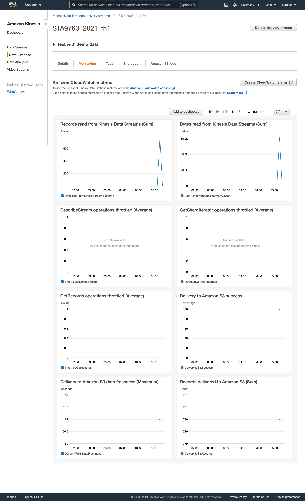

## Project 01: Streaming Finance Data with AWS Lambda

In the following project, we demostrate of AWS Kinesis, AWS Glue, AWS Athena in order to pull data from the stock market on May 11 2021. In order to do so, we used the yahoo finance package to pull the data using a lambda function. In this case, we pulled the data using lambda and saved it in an s3 bucket. After doing so, we configured AWS Athena run queries that can later be used for analysis. By saving our query results as an CSV file, we were able to load it on Jupyter Notebook to create analysis. The following packages used were used to develop visualizations: seaborn, pandas, matplot. The following are screenshots for the configuration/monitoring used in the following project for the Kinesis:

****

